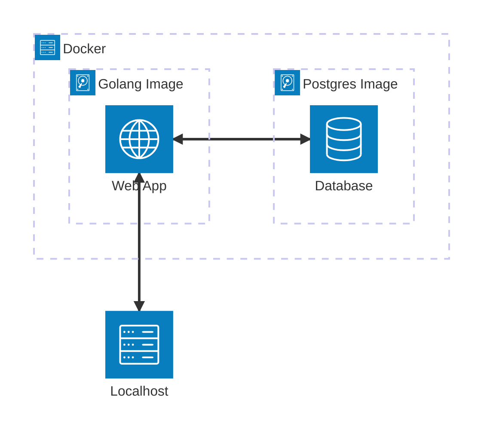

# Go API Project

This is a simple project I created using Golang, which creates a basic API that returns album information obtained from a Postgres database. This project provides a brief introduction to the Go programming language, Docker and containerization, PostgreSQL and databases, and web applications and APIs.

## Requirements

* [Docker](https://www.docker.com/)
* Go (will be installed on a Docker container)
* PostgreSQL (will be installed on a Docker container)
* [psql](https://www.postgresql.org/docs/current/app-psql.html)

## Project Structure

This project has two Docker images, a Golang image and a Postgres image.

* The Golang image will build and host the Go application, which is defined in the `./app` directory.
* The Postgres image will be used to build and host the `music` database, which will contain the `albums` table in which the album information will be stored.



The Golang and Postgres containers, which will be created from the aforementioned images, will be connected over the same Docker network so they can communicate with one another. The localhost will be able to access the web application, which will subsequently query the database on the Postgres contaienr to obtain the requested album information, which will then be returned to the localhost over HTTP. 

## Building the Project

The project can be built by navigating to the root of the repository on a command line and following the instructions below.

1. Ensure Docker and `psql` are installed.
2. Build the Golang image, which will contain the web application.
```
docker build -t golang-web-service -f Dockerfile.web .
```
3. Build the Postgres image, which will contain the database.
```
docker build -t postgres-db -f Dockerfile.db .
```
4. Run the application.
```
docker compose up
```

After the application has been built, you can try calling the API using a tool such as `curl`, or you can navigate to `http://localhost:8080/album/{id}` in a browser, replacing `{id}` with an integer value.

```
curl -s -XGET localhost:8080/album/2
```

## Extending the Project

Once you are comfortable with building the application and retrieving data, try adding features such as the ability to add, modify, and remove album information using other HTTP methods, such as `POST`, `PUT`, and `DELETE`.
